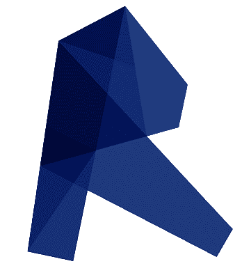

# Bem Vindo!

## Quem sou eu

:cloud_with_lightning: Estudante de Engenharia de Energia - UFSC!

:computer: Estudante de Ciência de Dados - UFSC!

🛫 Mecânico de Aeronaves - EEAR/SP!

:books: Estou lendo:

   

:rocket: Objetivos para 2022: Me aprofundar em ciência de dados, conseguir mais experiência nessa área e aumentar meu network de profissionais em Data Science! ✔️

:rocket: Objetivos para 2023: Aumentar minhas habilidades em estatística e conseguir o primeiro estágio na área!

## Linguagens de programação
   

## Habilidades
### Ciência de dados
  &emsp; 
 
 
### Engenharia
 
 
### Linguagens de estilo 
  &emsp; 
 
### Banco de dados
### Framework

## Redes Sociais

## Minhas Contribuições

##

